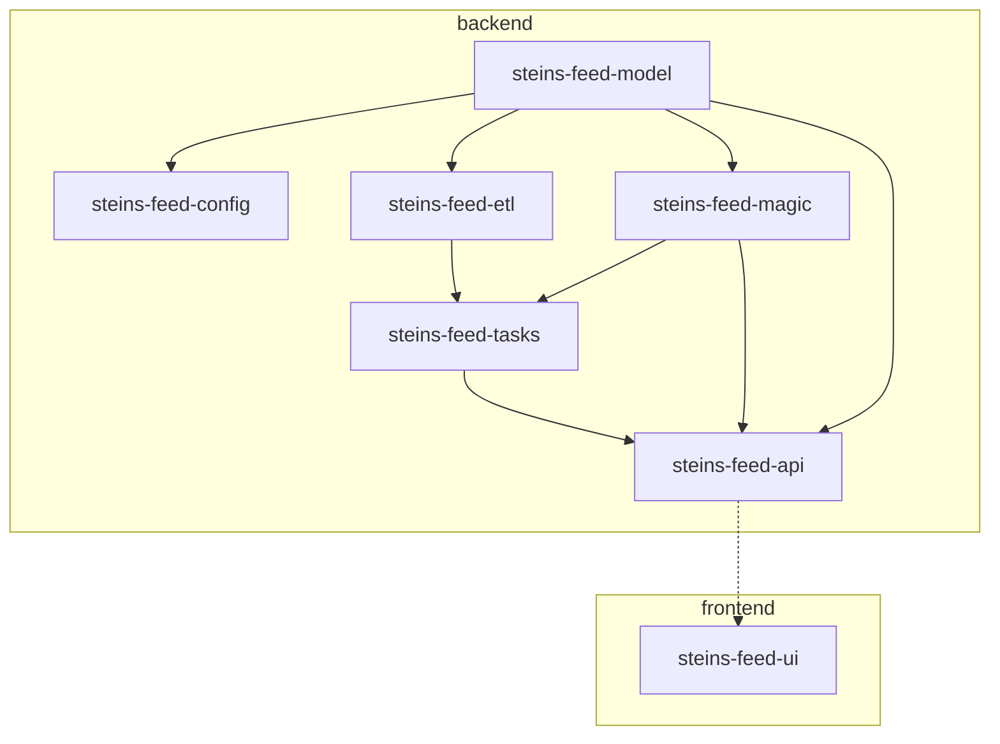
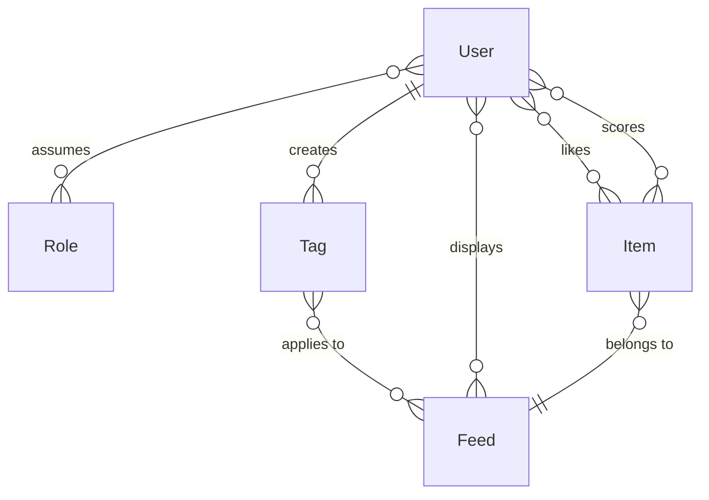

# steins-feed-mono

## Architecture

Application:

```mermaid
flowchart TD
    subgraph backend
    steins-feed-model --> steins-feed-config
    steins-feed-model --> steins-feed-etl
    steins-feed-model --> steins-feed-magic

    steins-feed-etl --> steins-feed-tasks
    steins-feed-magic --> steins-feed-tasks

    steins-feed-magic --> steins-feed-api
    steins-feed-model --> steins-feed-api
    steins-feed-tasks --> steins-feed-api
    end

    subgraph frontend
    steins-feed-ui
    end

    steins-feed-api -.-> steins-feed-ui
```

Database:

```mermaid
erDiagram
    User }o--o{ Role: assumes

    Tag }o--o{ Feed: "applies to"
    User ||--o{ Tag: creates
    User }o--o{ Feed: displays

    Item }o--|| Feed: "belongs to"
    User }o--o{ Item: "likes"
    User }o--o{ Item: "scores"
```
